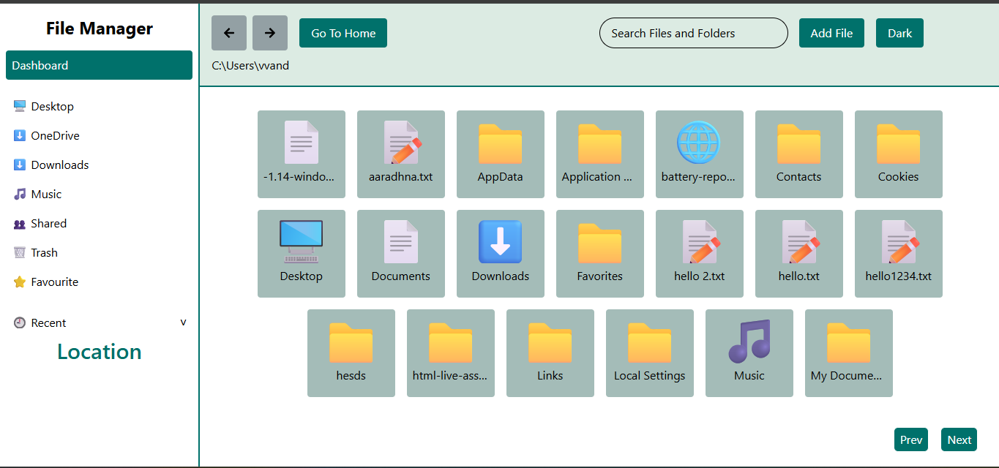
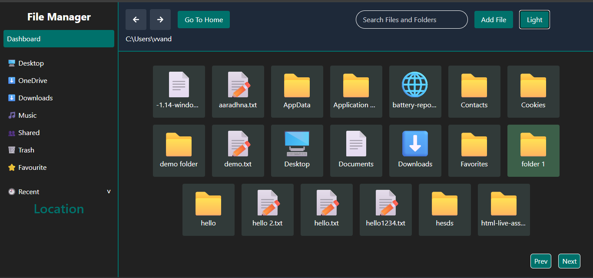

# 📁 File Management System

## Table of contents

- [Overview](#overview)
- [Features](#-features)
- [Technology Used](#️-technologies-used)
- [Installation](#-installation)
- [Usage](#-usage)
- [Project Scope & Limitations](#-project-scope--limitations)
- [Contributation](#-contributions)

# Overview

A File Management System built with React that allows users to browse, manage, and organize files and folders directly from their browser. It provides functionalities similar to a typical file explorer, including file creation, folder creation, search, and navigation controls.

## Project Demo

## Demo Video

[Preview](assets/demo.mp4)

## ✨ Features

- **Browser Files and Folders**: View all files and folders from the user's computer in a clean and intuitive interface.
- **Create New Files and Folders**: Add new files and folders directly from the application.
- **Search Functionality**: Quickly search for files and folders by name.
- **Navigation Controls**: Navigation backward and through previously visited directrioies.
- **Browser-Based Interface**: No need to install additional software; everything runs in your browser.

## 🛠️ Technologies Used
- ⚛️ **Frontend**: React.js
- 🔗 **Statement Management**: React Hooks
- 🎨 **Styling**: CSS 
- 📁 **File Handling** : Browser APIs

## 💻 Installation

1. Clone the repository

    `https://github.com/Vandana6261/file-management-system-react.git`

2. Navigate to the project folder

    `cd file-management-system-react`

3. Install dependencies
    
    `npm install`

4. Run the Frontend

    `npm start`

This will start the React development server.

Open your browser and go to http://localhost:3000

### Running Backend 
1. Navigate to the backend folder:
    cd backend
2. Install backend dependencies:
    npm install
3. Start the backend server:
    npm start

- By default, the server will run on http://localhost:5000

- Make sure your frontend connects to this server (update API_URL in your frontend if needed).

## 🚀 Usage
Open the application in your browser at http://localhost:3000
Use the interface to:

- 📂 Browse files and folders.

- 📝 Create new files and folders.

- 🔍 Search for files by name.

- ⬅️➡️ Navigate through directories using backward and forward buttons.

## 📌 Project Scope & Limitations
❌ No delete file functionality

❌ No authentication or permissions

❌ Basic UI (functionality-focused)

## 🤝 Contributions

Contributions are welcome! If you want to add features or improve the project, please follow these steps:

1. Fork the repository
2. Create a new branch (git checkout -b feature-name)
3. Make your changes.
4. Commit your changes (git commit -m 'Add some feature')
5. Push to the branch (git push origin feature-name)
6. Open a Pull Request

✅ This version clearly separates frontend and backend steps, and adds instructions for running locally without live deployment issues